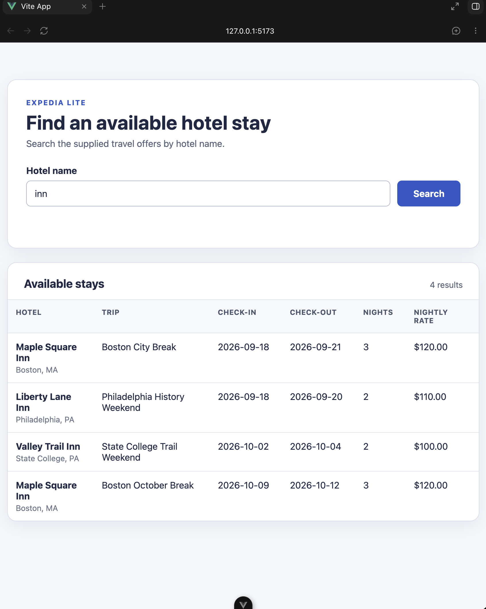

# Expedia Replica — Part 1

## Repository and commit
Repository: https://github.com/dw477/expedia-replica
Commit: e762734

## Implementation
The frontend recieves data given by the user, FastAPI takes the data and sends it to the backend, and the backend sends information back to the frontend to be displayed.

## Verification
Manual review of the first iteration functioned nearly as expected. The table and search bar were both visible and functioning as shown by the successful result given when searching for a city within the data. The only difference from the expected result was for the search to be by hotel name, not city name.

## Project context and next steps
[README](../README.md), [AGENTS](../AGENTS.md), [DESIGN NOTE](../docs/design.md), [PROMPTS](../prompts/prompts.md), [HANDOFF](../handoffs/current.md)

Remaining limitations reside in search functionality and data handling with a database.