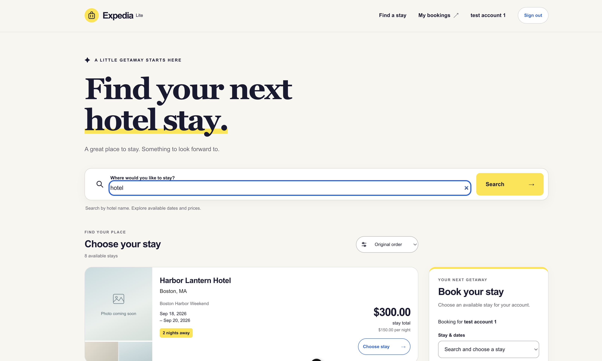
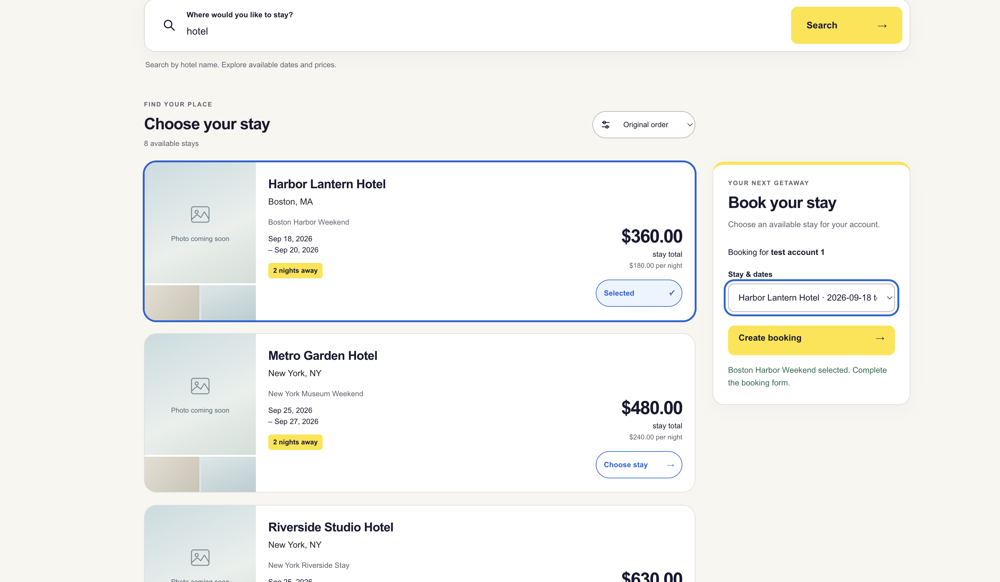
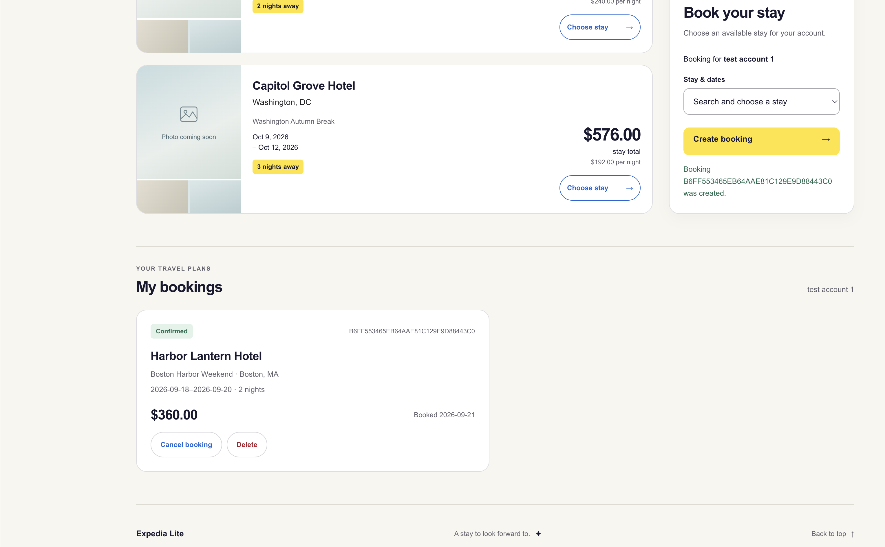

# Expedia Replica — Part 2

## Repository and commit
Repository: https://github.com/dw477/expedia-replica

Commit: df8632f

## Implementation
With part 2, multiple things in the frontend and backend have either been changed or implemented.

Starting with changes, the first is the upgrade to the user interface. The UI has been updated to reflect a polished website while retaining all backend functionality. The second change is to the structure of the repository. While similarly structured beforehand, the repository was changed to more strictly follow the Model-View-Controller frameowrk.

Onto what was added, the first is the integration of SQLite to handle database interaction. Records can now be added, changed, or removed while persisting across sessions. This also comes with an update to the frontend to handle data mutation. Second, functionality for user authentication was created to keep sessions between users separate. Users can either create an account or login, then they can create, cancel, or delete bookings on their account. Lastly, a surge pricing function was added to increase the price by 20% when a hotel is queried more than 3 times by the same person within the same day. Outside of those criteria, the price remains the base price.

## Verification

The first screenshot reflects **account creation**, a successful **login**, and the **search** for a hotel.

The second screenshot reflects the **surge-pricing** price increase as well as pre-booking **hotel selection**.

The third screenshot reflects a **successful booking** with the surge-pricing price.

Each action performed as expected.

## Project context
[README](../README.md), [AGENTS](../AGENTS.md), [DESIGN NOTE](../docs/design.md), [PROMPTS](../prompts/prompts.md), [HANDOFF](../handoffs/current.md)

## Demo Video

